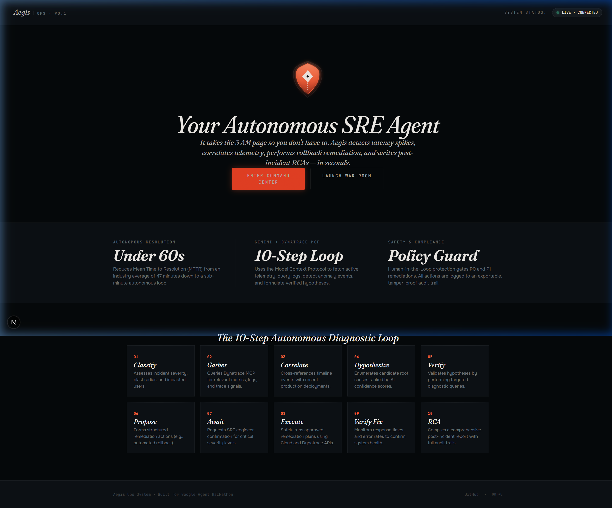
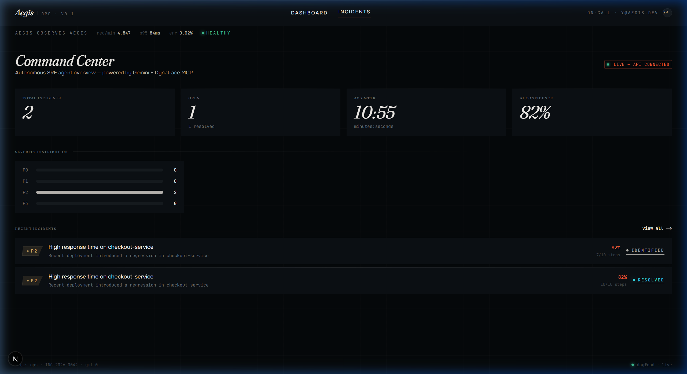
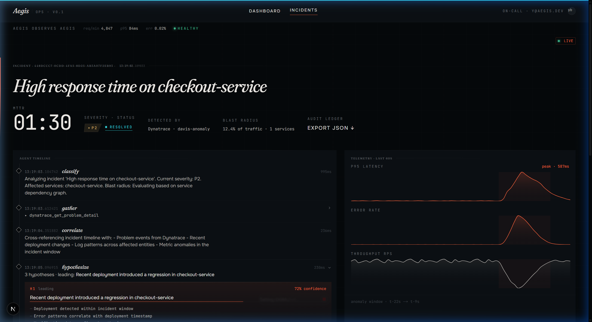
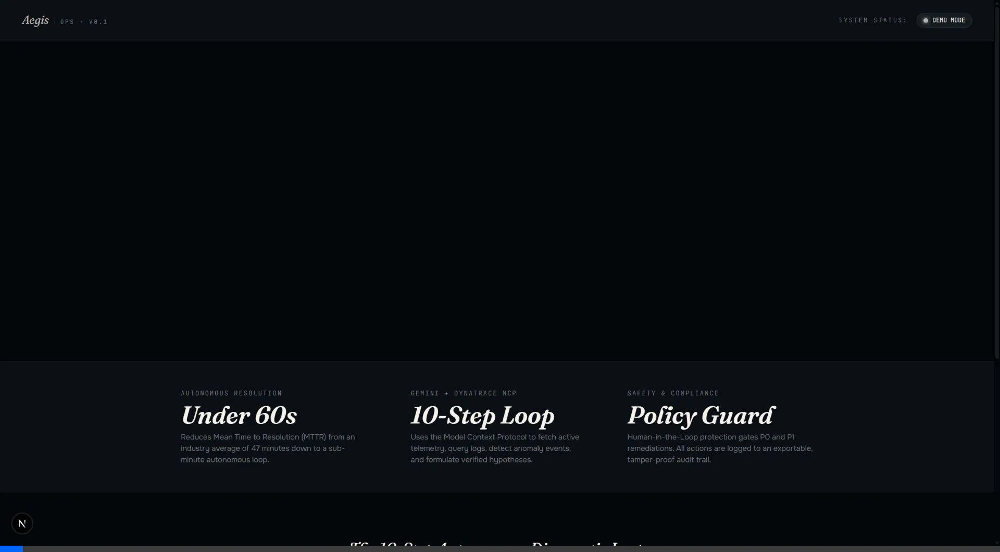
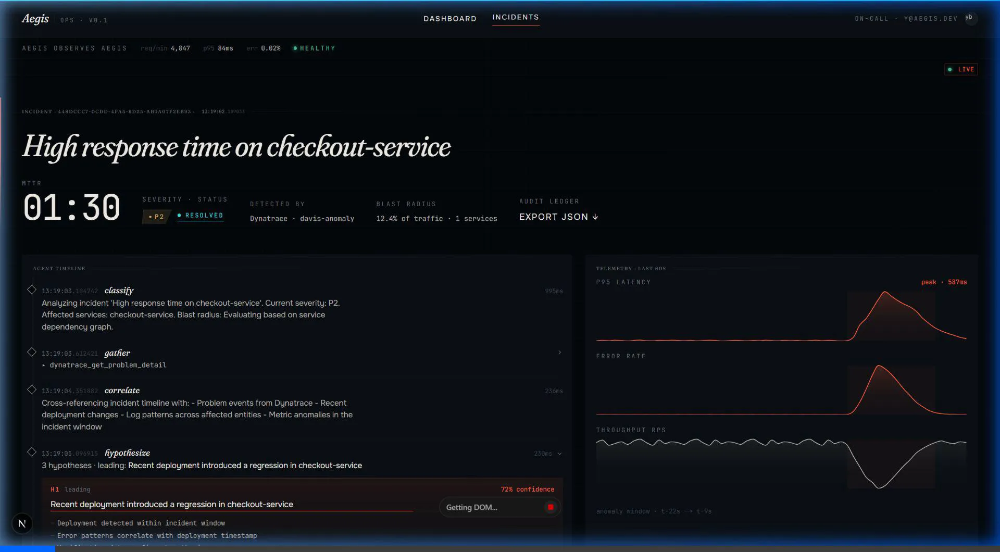

# Aegis Project Walkthrough

This document showcases the features, design, and workflows of **Aegis — Autonomous SRE Agent** built for the Google Agent Hackathon.

---

## 🎨 Premium Landing Page & Brand Identity

We replaced the direct redirect with an immersive landing page (`/`) featuring:
*   **Aegis Logo:** A custom geometric vector shield logo styled with smooth linear gradients from persimmon ember to gold and an inner core indicator.
*   **Late-Shift Editorial Typography:** Bold header weights using Fraunces and data metrics rendered in JetBrains Mono.
*   **System Status Radar:** Real-time API connection telemetry showing whether the server is connected (`LIVE · CONNECTED`) or in fallback (`DEMO MODE`).
*   **The 10-Step Autonomous Loop Grid:** Individual cards explaining each stage of the diagnostic pipeline.
*   **Exportable Audit Ledger:** Added an "Export JSON ↓" button inside the incident header, allowing users to download the full, structured JSON audit payload (including tool calls, telemetry data, and hypotheses) directly to their machine.

### 🖼️ UI Visuals

Here is the screenshot of the landing page at `http://localhost:3000/`:

Here is the screenshot of the Command Center dashboard at `http://localhost:3000/dashboard`:

Here is the screenshot showing the new **Export JSON ↓** button inside the incident header:

---

## 📽️ Interaction Recordings

We ran validation tests using automated browser subagents to record the page flows.

### 1. Landing Page Navigation Recording
This recording shows the subagent navigating to the landing page, verifying status indicators, and clicking "Enter Command Center":

### 2. Export Audit Ledger Button Demo Recording
This recording shows the new "Export JSON" button rendering in the incident header:

### 3. Autonomous SRE Incident Investigation & Approval Recording
This recording shows the agent loop diagnosing a latency spike in the War Room, executing tool calls, proposing a rollback, awaiting human-in-the-loop approval, executing the fix, and resolving the incident in under a minute:

---

## 🛠️ Setup & Recording Script

For instructions on launching servers, triggering test incidents via PowerShell, and a detailed voiceover script for your 3-minute recording, refer to the [Recording Guide](DEMO_SCRIPT.md).
